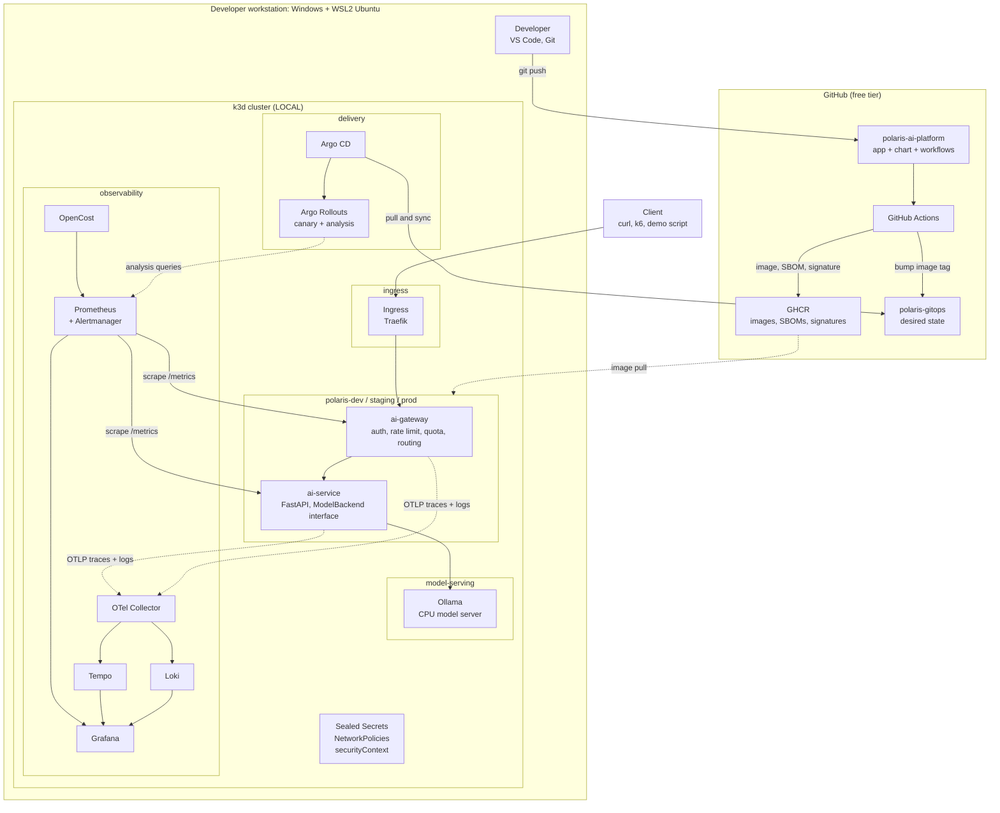
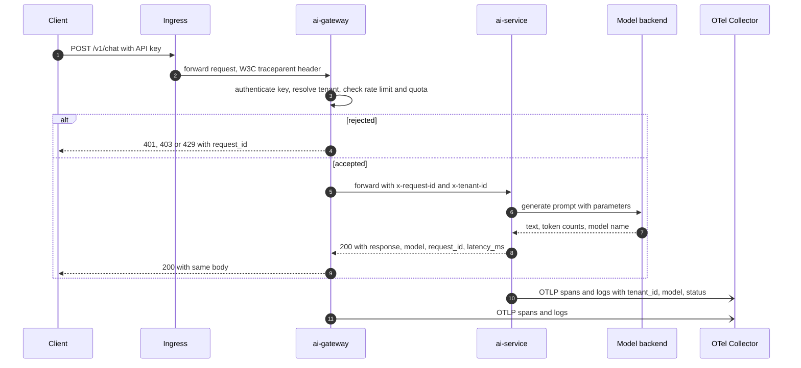
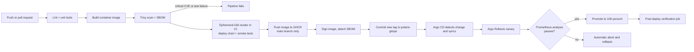
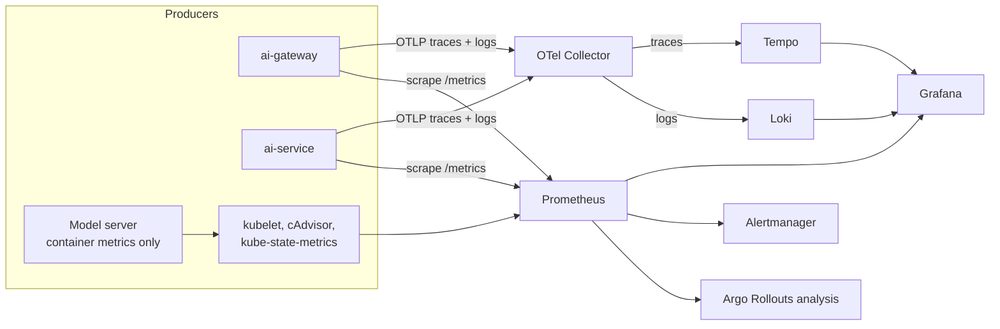
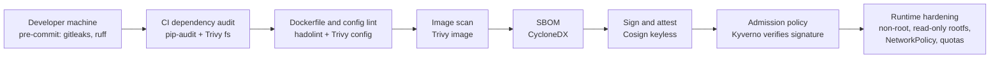
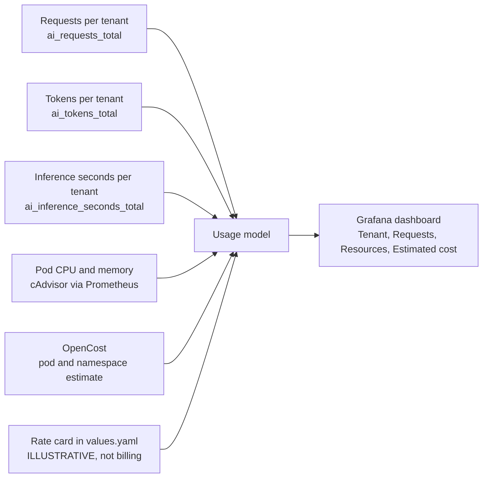
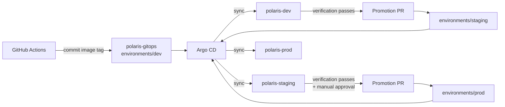

# Polaris AI Platform — Architecture

> **Status:** living design document. It started as the Phase 0 design (no implementation code) and is updated as each phase lands; the README shows which phases are done.
> **Audience:** the builder, an AI coding assistant used for implementation, and engineers or hiring managers reviewing the project.
> **Labelling rule:** every component in this document is tagged **LOCAL** (runs on a developer workstation), **DEMO** (a scripted, seeded subset used in the 10–15 minute demonstration) or **PROD-EQUIVALENT** (what an enterprise would run). Nothing here claims that a local setup equals enterprise production.

---

## 0. Assumptions

| # | Assumption | If it is wrong |
|---|-----------|----------------|
| A1 | Requirements come from the role description summarised in the project brief (delivery, model serving, routing and observability layer of an AI platform). | The coverage matrix (Part C) is re-run against the actual text. |
| A2 | Workstation: **≥ 16 GB RAM, ≥ 6 CPU cores, ≥ 60 GB free disk**, no usable GPU. WSL2 (Ubuntu 24.04) is installed or installable. Phase 1 verifies everything with commands; nothing is assumed installed. | With 8 GB RAM we drop Ollama to a mock-only mode and run observability in reduced form. |
| A3 | Development happens inside **WSL2** (repo stored on the Linux filesystem, e.g. `~/polaris`, not `/mnt/c/...`), with Windows PowerShell only for host-level tasks (WSL config, Docker Desktop if used). | Performance of file watching and container builds drops sharply on `/mnt/c`. |
| A4 | Public GitHub repositories, free GitHub Actions minutes, free GHCR (GitHub Container Registry). | Private repos have lower free minutes; nothing else changes. |
| A5 | No paid cloud. Cloud Terraform in this project is **written and `plan`-validated only, never applied**. | — |
| A6 | Prior hands-on work with Kind, FluxCD, Terraform and the Grafana LGTM stack exists (`terraform-k8s-platform`). This project therefore deliberately adds what that work does not show: Argo CD + Argo Rollouts, OpenTelemetry end to end, model serving, AI-specific observability, FinOps, supply-chain signing. | If FluxCD is preferred, ADR-02 flips to Flux + Flagger. |

---

# Part A — Initial analysis

## A1. What this role actually is

The role is **not** "build models". It is the **platform underneath the models**: the layer that delivers AI services safely, serves models, routes traffic to them, and makes their behaviour and cost visible.

That gives four verbs and three cross-cutting concerns:

| Verb | Meaning | Job-description keywords |
|------|---------|--------------------------|
| **Ship** | Get a change from a developer's laptop to production, verified, with automatic rollback | CI/CD/CV, GitOps, Helm, progressive rollout, rollback |
| **Serve** | Run model inference reliably and swap serving engines without rewriting clients | Ray, vLLM, Triton, NIM, GPU telemetry |
| **Route** | Put one governed front door in front of many models and tenants | Envoy/API gateway, quotas, rate limits, multi-tenant |
| **Observe** | See technical health, AI quality and cost in one place | OpenTelemetry, Prometheus, Grafana, Loki, Tempo/Jaeger, Langfuse/LangSmith, OpenCost/Kubecost |
| *Secure* (cross-cutting) | Trust what you run | Trivy, SBOM, secure sandboxing, secure configuration |
| *Govern* (cross-cutting) | Know what runs where and who owns it | MLflow, Harbor, OpenLineage, governance |
| *Attribute* (cross-cutting) | Know who caused which cost/load | FinOps, cost attribution, multi-tenant |

**Project thesis (use this sentence in the README and in interviews):**

> An AI workload is an ordinary distributed service with three extra properties: its output quality is non-deterministic, its cost scales with tokens, and its runtime (the model server) is heavy and stateful. The platform's job is to make those three properties *visible, controllable and safe to change*.

Every component in this design exists to serve one of those three properties or one of the four verbs. If it does not, it is not built.

## A2. Major engineering domains

| # | Domain | Core question it answers | Phases |
|---|--------|--------------------------|--------|
| 1 | **Delivery** (CI, CD, Continuous Verification, GitOps, progressive delivery) | "How does a change reach production safely and reversibly?" | 6, 7, 8, 18 |
| 2 | **Runtime platform** (Kubernetes, Helm, quotas, autoscaling, multi-environment) | "Where and how does it run, reproducibly?" | 1, 4, 5 |
| 3 | **AI serving** (model server, inference, concurrency, GPU concepts) | "How is a model loaded and served, and how do we replace the engine later?" | 2, 11 |
| 4 | **Traffic management** (gateway, auth, rate limit, routing, streaming) | "Who may call what, how often, and where does it go?" | 12 |
| 5 | **Observability** (metrics, logs, traces, OTel, dashboards, alerts, cardinality) | "Is it healthy, and can we follow one request across every hop?" | 9, 10 |
| 6 | **AI quality** (evaluation, prompt/model versioning) | "Is it still *good*, not merely *up*?" | 16, 17 |
| 7 | **FinOps** (token, CPU, memory cost attribution) | "Who is spending what?" | 13 |
| 8 | **Security & supply chain** (CVE scanning, SBOM, signing, secrets, least privilege) | "Can we trust the image, the config and the runtime?" | 3, 6, 15 |
| 9 | **Governance & multi-tenancy** | "Which model/prompt/config version ran for which tenant, owned by whom?" | 14, 16 |
| 10 | **Reliability engineering** (failure injection, SLOs, rollback) | "Do we detect and recover from failure automatically?" | 19, 20 |

## A3. Minimum Viable Version (MVP)

**MVP = Phases 1–10, plus a minimal version of Phase 18 (canary + auto-rollback) and Phase 19 (three failure scenarios), plus a short Phase 20 demo.**

Acceptance test for the MVP — one scripted sequence that shows:

1. A code change is pushed to GitHub.
2. GitHub Actions lints, tests, builds, scans (Trivy), generates an SBOM, publishes to GHCR.
3. The gitops repo is updated with the new image tag.
4. Argo CD syncs the cluster; Argo Rollouts performs a canary.
5. Prometheus-based analysis (error rate + p95 latency) passes or fails the canary.
6. A deliberately broken version is **automatically rolled back**.
7. One `POST /v1/chat` request can be followed as metrics + logs + one trace in Grafana, tagged with `tenant_id`.

This is already a strong, honest portfolio. Everything after Phase 10 is depth, not foundation.

**Tiering of the 20 phases:**

| Tier | Phases | Purpose |
|------|--------|---------|
| **Tier 1 — Core (MVP)** | 1–10, plus minimal 18 and 19, short 20 | A complete deliver → run → observe → recover loop |
| **Tier 2 — Differentiators** | 11 (Ollama), 12 (gateway), 13 (FinOps), 14 (multi-tenancy), full 18, full 19 | What separates this from a generic DevOps demo: AI serving, tenants, cost |
| **Tier 3 — Depth** | 15 (hardening), 16 (governance), 17 (AI evaluation), full 20 | Security depth, governance, AI quality observability |

Note that the *basics* of Phase 15 (non-root, Trivy, SBOM) already happen in Phases 3, 4 and 6. Phase 15 adds signing, network policies, secret management and admission policy.

## A4. Optional advanced features (only after Tier 2 works)

- Image signing and verification: **Cosign keyless** (GitHub OIDC) + **Kyverno** policy that only admits signed images.
- A second cluster (`prod-like`) so promotion crosses a real cluster boundary.
- **MLflow** (SQLite backend) as a real model/run registry instead of a Git-based manifest.
- **Langfuse** self-hosted (heavy: Postgres + ClickHouse + Redis) as the LLM tracing UI.
- **vLLM CPU build** or `llama.cpp` server as a second model backend, to prove the backend interface is genuinely swappable.
- **Envoy Gateway** (Kubernetes Gateway API) in front of the custom gateway.
- **Terraform** bootstrap of the local cluster + Argo CD (reusing patterns from `terraform-k8s-platform`) and a cloud (EKS/AKS) module that is validated with `terraform plan` only.
- Simulated load generator producing realistic multi-tenant traffic (k6 or Locust).

## A5. What should NOT be built initially — and why

| Not built | Why not (yet) | What we do instead |
|-----------|---------------|--------------------|
| **Kafka** | No workload here needs a durable event bus. Adding it "because the JD says so" violates "every component must have a purpose". | Document where it fits (async usage events, audit log stream). |
| **Ray Serve / Triton / NVIDIA NIM** | Require GPUs or are large; local benefit is low. | Ollama locally behind an OpenAI-compatible interface; document the vLLM/Triton/NIM production mapping. |
| **GPU telemetry (DCGM exporter)** | No GPU. Faking GPU metrics would be dishonest. | Document DCGM → Prometheus → Grafana as the production equivalent. **Never** show simulated GPU graphs as real. |
| **Service mesh (Istio/Linkerd/Cilium mesh)** | Large RAM/complexity cost, no requirement here beyond mTLS concepts. | NetworkPolicies now; document mesh as production option. |
| **Harbor** | ~2 GB RAM, heavy for a single-developer registry. | GHCR + local k3d registry; document Harbor (replication, RBAC, vulnerability scanning, retention). |
| **Kubecost** | Free tier is limited and needs account registration. | **OpenCost** (CNCF, free) plus a transparent custom tenant-cost model; document Kubecost. |
| **OpenLineage / Marquez** | No data pipelines exist to have lineage. | Document; governance manifest carries the version fields. |
| **Vault** | Operational overhead disproportionate to benefit here. | Sealed Secrets; document External Secrets Operator + cloud secret manager / Vault. |
| **Real model training / fine-tuning** | Out of scope for this role. | None. |
| **Multi-cluster / multi-region** | RAM. | Namespaces as environments; document the real topology. |
| **Custom Kubernetes operators / CRDs** | Complexity without a requirement. | Use existing operators (Argo, Prometheus Operator). |

---

# Part B — Phase 0 deliverables

## 1. Project name

**Polaris AI Platform** (working name; rename freely).

| Repository | Purpose | Created in |
|------------|---------|-----------|
| `polaris-ai-platform` | Application source, Helm chart, CI workflows, docs, scripts. The "front door" of the portfolio. | Phase 1 |
| `polaris-gitops` | Deployment configuration only: Argo CD Applications, per-environment values, image tags. Git is the source of truth for cluster state. | Phase 8 |

Until Phase 8, deployment files live under `deploy/` in the main repository. Phase 8 **extracts** them into `polaris-gitops` (a deliberate, explained architecture change — see ADR-08).

## 2. Executive summary

Polaris is a locally runnable, production-inspired platform for delivering, serving, routing and observing AI services. A small FastAPI service exposes `POST /v1/chat` and talks to a model through a swappable backend interface (a deterministic mock first, then a CPU-only Ollama model server). The service is containerized, scanned, packaged as a Helm chart, delivered through GitHub Actions and Argo CD, released progressively with Argo Rollouts, and observed with OpenTelemetry, Prometheus, Loki, Tempo and Grafana. A thin gateway adds authentication, per-tenant rate limits and quotas. Every request is attributable to a tenant, which feeds a transparent (clearly labelled *estimated*) cost model and AI-quality evaluation. Failure injection proves that the system detects problems and recovers automatically.

It does **not** claim enterprise scale. It demonstrates that the same engineering concepts — and the same decision-making — can be implemented, explained and operated.

## 3. Business and technical problem

**Business problem.** Teams that ship LLM-backed features hit the same walls: releases that silently degrade answer quality, cost that grows with usage and cannot be attributed, one noisy tenant starving the others, models and prompts changed with no record of what ran when, and images pulled into production with unknown contents.

**Technical problem → capability → phase:**

| Problem | Capability the platform provides | Phases |
|---------|----------------------------------|--------|
| "Did this release break anything?" | CI gates, continuous verification, canary analysis, auto-rollback | 6, 7, 18 |
| "What is deployed where, and who changed it?" | GitOps: Git is the desired state, drift is corrected | 8 |
| "Where did this slow request spend its time?" | Distributed tracing across gateway → service → model | 9, 10 |
| "Is the AI still good, or just still up?" | Evaluation dataset, scores tracked per prompt/model version | 17 |
| "Who is costing us money?" | Tenant-attributed usage and estimated cost | 13, 14 |
| "Can a tenant overload the model?" | Rate limits, quotas, resource limits | 12, 14 |
| "Do we trust this image?" | CVE scan, SBOM, signing, non-root, network policy | 3, 6, 15 |
| "Which model and prompt version answered this?" | Governance manifest, version labels on every signal | 16 |
| "Can we swap the model engine?" | Backend interface + OpenAI-compatible protocol | 2, 11 |

## 4. Architecture overview

### 4.1 Layers

| Layer | Responsibility | Components |
|-------|---------------|------------|
| **Edge** | Single entry point, TLS/routing | Ingress (Traefik first; Envoy Gateway evaluated in Phase 12) |
| **Traffic** | Auth, per-tenant rate limit and quota, request IDs, routing, error shaping | `ai-gateway` |
| **Application** | Chat API, prompt handling, telemetry, model abstraction | `ai-service` (FastAPI) with a `ModelBackend` interface |
| **Model serving** | Load model, run inference | Mock backend (in-process), then Ollama (CPU) |
| **Delivery** | Build, verify, publish, deploy, roll back | GitHub Actions, GHCR, Argo CD, Argo Rollouts |
| **Observability** | Metrics, logs, traces, dashboards, alerts | OTel Collector, Prometheus, Loki, Tempo, Grafana, Alertmanager |
| **FinOps** | Usage and cost attribution | Custom tenant metrics + OpenCost |
| **Security** | Supply chain, secrets, runtime hardening | Trivy, SBOM, Cosign (optional), Sealed Secrets, NetworkPolicy, securityContext |
| **Governance** | Version and ownership records | Git-based manifest → optional MLflow |

### 4.2 The three architectures (never confuse them)

| | **Production architecture** (PROD-EQUIVALENT) | **Local development architecture** (LOCAL) | **Portfolio demonstration architecture** (DEMO) |
|---|---|---|---|
| Purpose | What an enterprise runs | The daily workspace | A scripted 10–15 minute story |
| Cluster | Managed K8s (EKS/AKS/GKE), multiple clusters/regions | One k3d cluster in WSL2 (1 server + 2 agents) | Same cluster, fresh reset via script |
| Environments | Separate clusters/accounts per env | Namespaces `polaris-dev`, `polaris-staging`, `polaris-prod` | Same, seeded with tenants and load |
| Model serving | vLLM/Triton/NIM on GPU node pools | Ollama, small CPU model, or mock | Mock for deterministic failure demos; Ollama for a "real" answer |
| Registry | Harbor / ECR / ACR with replication and retention | GHCR + optional local k3d registry | GHCR |
| Secrets | External Secrets + cloud secret manager/Vault | Sealed Secrets | Sealed Secrets |
| Traffic | Envoy/Kong/Istio gateway, WAF, global LB | Traefik + `ai-gateway` | Same |
| Observability | Managed or HA Grafana stack, long retention, alert routing | Single-binary Loki/Tempo, short retention | Pre-built dashboards + saved Explore links |
| Data | Durable, replicated | Ephemeral / small PVCs | Recreated on reset |
| Failure demo | Game days, chaos engineering | Manual fault switches | Scripted fault injection (`scripts/demo/`) |

### 4.3 Namespaces in the local cluster

```
polaris-dev / polaris-staging / polaris-prod   ← application environments (same chart, different values)
model-serving                                  ← ONE shared Ollama (RAM constraint; prod would be per-environment)
observability                                  ← OTel Collector, Prometheus, Loki, Tempo, Grafana, OpenCost
argocd, argo-rollouts                          ← delivery tooling
sealed-secrets (kube-system or own)            ← secret decryption controller
ingress                                        ← Traefik (k3s default) or Envoy Gateway later
```

## 5. Component diagram



Reading the diagram: solid arrows are request or control flow, dotted arrows are telemetry or pull-based interactions. Note that **the cluster pulls from GitHub** (Argo CD, image pulls); GitHub never needs inbound access to your workstation. This is why a local cluster can still practise real GitOps (see ADR-12).

## 6. Data flow

| Data | Origin → destination | Format / protocol | Retention (LOCAL) | Sensitivity |
|------|---------------------|-------------------|-------------------|-------------|
| **Chat request/response** | Client → gateway → service → model → back | HTTP/JSON (later SSE streaming) | Not stored | Contains user text; treat as sensitive |
| **Metrics** | Gateway/service `/metrics` → Prometheus → Grafana, Argo Rollouts | Prometheus exposition format, scraped | ~7 days | Aggregated; **no** request IDs or prompts |
| **Traces** | Gateway/service → OTel Collector → Tempo → Grafana | OTLP (gRPC/HTTP) | ~24–72 h | Attributes limited to an allow-list (below) |
| **Logs** | Gateway/service stdout (JSON) → OTel Collector → Loki → Grafana | JSON lines, OTLP/log pipeline | ~24–72 h | Prompt text **never** logged by default |
| **Cost/usage** | Service counters (tokens, inference seconds per tenant) + cAdvisor/OpenCost → Prometheus → dashboard | Prometheus series | ~7 days | Estimates, not billing |
| **Artifacts** | CI → GHCR (image), SBOM (CycloneDX), signature, scan reports (SARIF) | OCI, JSON | Per GHCR policy | Public repo ⇒ assume public |
| **Deployment config** | CI → `polaris-gitops` → Argo CD → cluster | YAML (Helm values, Applications) | Git history | No plaintext secrets |
| **Governance record** | Manifest in Git + `/v1/meta` endpoint + Prometheus info metric | YAML/JSON | Git history | Non-sensitive |

**Trace/log attribute allow-list** (enforced in Phase 10): `tenant_id`, `request_id`, `model`, `model_version`, `prompt_version`, `endpoint` (route template), `http.status_code`, `latency_ms`, `prompt_tokens`, `completion_tokens`, `env`, `deployment_version`. **Never**: prompt text, completion text, API keys, `Authorization` headers, client IPs (unless explicitly justified). Prompt *length* and token counts are safe substitutes.

## 7. AI request flow



**Design decisions embedded in this flow**

1. **Phase 2 trusts `tenant_id` from the request body** (simple, demo-grade). **From Phase 12/14 the gateway derives the tenant from the API key**, and a mismatching body `tenant_id` is rejected with 403. A tenant identity supplied by the caller must never be authoritative — this is the kind of point interviewers probe.
2. **`request_id` is generated at the edge** (gateway) if the client does not provide one, propagated as `x-request-id`, returned in the response, and attached to every log line and span.
3. **`traceparent` (W3C Trace Context)** is propagated end to end so one trace covers gateway → service → model call.
4. **The `ModelBackend` interface** has at least `MockBackend` (deterministic; configurable latency and failure rate for failure engineering) and `OpenAICompatBackend` (talks to Ollama, and later vLLM or any OpenAI-compatible server). Swapping engines is configuration, not code change.
5. **Latency and token counts** are measured in the service around the backend call, so model time and platform overhead can be separated in traces.

## 8. CI/CD flow



**Vocabulary (implemented and demonstrated in Phase 7):**

| Term | Question it answers | Where it runs here |
|------|--------------------|--------------------|
| **CI** — Continuous Integration | "Does this change build, pass tests and meet quality/security gates?" | GitHub Actions |
| **CD** — Continuous Delivery | "Is every passing change *ready* to deploy, automatically packaged and publishable?" | GHCR + gitops commit |
| **Continuous Deployment** | "Is it deployed to production automatically, with no human approval?" | Dev/staging automatic; prod-like requires merging a Git PR (deliberate choice) |
| **CV** — Continuous Verification | "After it is deployed, does it actually behave correctly — health, metrics, logs, AI answers — and do we act on the answer?" | Argo Rollouts analysis + post-deploy verification job |

**The two verification loops (important design point).** GitHub-hosted runners cannot reach a cluster on a developer laptop. Rather than exposing the machine (tunnels) or installing a self-hosted runner on a public repo (a real security risk), Polaris uses two loops:

1. **Pre-merge loop in CI:** an ephemeral k3d cluster is created *inside the runner*, the Helm chart is deployed, and smoke/contract tests run. This proves "the chart deploys and the API works".
2. **Post-deploy loop in the local cluster:** Argo Rollouts `AnalysisTemplate`s query Prometheus (error rate, p95 latency, later eval score) during the canary and decide promote-or-rollback. A verification `Job` then checks health, API, metrics presence, logs presence and a basic AI answer.

This split is also how many real organisations work (ephemeral-environment tests before merge; progressive delivery with metric analysis after).

## 9. Observability flow



**Signal design**

| Signal | How produced | Why this way |
|--------|-------------|--------------|
| **Metrics** | `prometheus_client` in the app, scraped via `ServiceMonitor` | Simple, standard, mature exemplar support; scraping is what Prometheus, Argo Rollouts and OpenCost expect (ADR-06) |
| **Traces** | OpenTelemetry SDK + OTLP → Collector → Tempo | Vendor-neutral, the industry direction; Tempo integrates with Grafana trace↔log↔metric jumps |
| **Logs** | JSON to stdout with `trace_id`, `span_id`, `request_id`, `tenant_id`; collected by the OTel Collector `filelog` receiver → Loki | Structured logs make correlation a query, not grep |

**Correlation:** Grafana *derived fields* (Loki → Tempo via `trace_id`), *trace-to-logs* (Tempo → Loki), and *exemplars* (metric point → trace).

**Initial SLIs (used both for dashboards and for rollout gating):**

| SLI | Definition | Local target (illustrative) |
|-----|-----------|----------------------------|
| Availability | non-5xx responses ÷ all responses | ≥ 99 % over the canary window |
| Latency | p95 of `POST /v1/chat` | ≤ 300 ms (mock) / ≤ 5 s (Ollama CPU) — calibrated in Phase 9/11 |
| AI quality (Phase 17) | mean evaluation score on the golden dataset | ≥ baseline − tolerance |

**Cardinality rule (taught in Phase 10).** Every unique combination of label values is a separate time series; memory and cost grow with the number of *active series*. Therefore:

| Allowed as metric labels (bounded) | Forbidden as metric labels (unbounded) — put in logs/traces instead |
|-----------------------------------|--------------------------------------------------------------------|
| `tenant_id` (a handful), `model`, `endpoint` (route template), `status_class`, `env`, `prompt_version` | `request_id`, `trace_id`, prompt text, raw URL with IDs, session/user IDs, timestamps |

---

## 10. Security flow



| Stage | Control | Fails the pipeline / blocks when | Phase |
|-------|---------|----------------------------------|-------|
| Commit | Secret scanning (gitleaks), lint | A secret pattern is found | 6, 15 |
| Dependencies | `pip-audit`, Trivy filesystem scan | Critical/High vulnerability with a fix available (policy defined in Phase 3) | 3, 6 |
| Build | Minimal base image, multi-stage build, non-root user, pinned versions | Dockerfile lint errors | 3 |
| Image | Trivy image scan (fail on CRITICAL, report HIGH) | Critical CVE | 3, 6 |
| SBOM | CycloneDX SBOM attached to the release | SBOM generation fails | 3, 6 |
| Signing (optional) | Cosign keyless via GitHub OIDC | Unsigned image rejected by Kyverno | 15 |
| Deploy | Secrets encrypted with Sealed Secrets, never plaintext in Git | Plaintext secret in Git (caught by gitleaks) | 15 |
| Runtime | `runAsNonRoot`, `readOnlyRootFilesystem`, dropped capabilities, seccomp `RuntimeDefault`, NetworkPolicies (default-deny + allow-list), ResourceQuotas | Pod violates Pod Security "restricted" | 4, 15 |
| Tenants | API keys stored hashed, tenant derived from key, per-tenant limits | Invalid key → 401; wrong tenant → 403 | 12, 14 |

**Rule:** all credentials are generated locally by a script and never committed in plaintext, and no credentials appear in this documentation. Tenant API keys will be created at deploy time, not invented in code.

## 11. FinOps flow



**Cost model (Phase 13), stated plainly so it can be defended:**

- *Shared resource cost* (model server, gateway, service pods) is measured from CPU and memory usage and priced with a **local, configurable rate card** (illustrative $/vCPU-hour and $/GB-hour). These figures are **assumptions, not real cloud prices and not billing data**.
- *Attribution to tenants:* model-server cost is split in proportion to each tenant's **inference seconds**; gateway/service cost is split by **request share**.
- *Showback token price:* an optional notional price per 1,000 tokens, again illustrative, so the dashboard can show a "what would an API provider have charged" comparison.
- Every panel and every exported number carries the label **"ESTIMATE — local, not billing data"**.
- OpenCost provides a second, independent pod/namespace-level estimate; the dashboard shows both and explains the differences. Kubecost is documented, not deployed.

## 12. GitOps flow



| Principle | How it is applied |
|-----------|-------------------|
| Git is the single source of truth | Nothing is deployed with `kubectl apply` after Phase 8, except bootstrapping Argo CD itself |
| Separate source from configuration | `polaris-ai-platform` (code) ≠ `polaris-gitops` (desired state) |
| Pull, not push | Argo CD inside the cluster pulls from GitHub; CI has no cluster credentials |
| Drift correction | Manual `kubectl edit` is reverted by Argo CD self-heal — demonstrated in Phase 8/19 |
| Rollback | `git revert` in `polaris-gitops` (audit trail) and automatic abort by Argo Rollouts (speed) |
| Promotion | dev automatic → staging via PR after verification → prod-like via PR with manual approval |
| Structure | "App of apps" / ApplicationSet: one root Application for platform components, one per environment |

## 13. Development environment

**Why WSL2:** the whole toolchain (Docker, k3d/k3s, Kubernetes tooling, Helm, Trivy) is Linux-native. WSL2 gives a real Linux kernel on Windows, so containers and Kubernetes behave as they will in production, without a heavyweight VM. Windows PowerShell is only used for host-level tasks (`.wslconfig`, updating WSL, optionally Docker Desktop).

**Working rules**

- Keep the repository on the Linux filesystem (`~/polaris/...`). Use VS Code with the WSL extension to edit it.
- Cap WSL2 resources in `%UserProfile%\.wslconfig` (memory and CPU limits) so Windows stays responsive. Exact values depend on the host hardware; see docs/deployment.md.
- Container runtime: **Docker Engine inside WSL2** is the recommendation (lighter, Linux-native, no desktop licensing questions). Docker Desktop is an acceptable alternative; Phase 1 will check what you have and decide — nothing is assumed installed.

**Toolchain (installed and verified step by step in Phase 1; version numbers are pinned then, after checking current releases — I am not guessing them here):** `git`, `gh` (GitHub CLI), Docker, `k3d`, `kubectl`, `helm`, `make`, `jq`, Python 3.12 with a virtual environment, and later `argocd` CLI, the `kubectl argo rollouts` plugin, `trivy`, `syft` (optional), `cosign` (optional), `kubeseal`, `k6`.

**Resource budget — estimates only; we measure the real numbers in Phases 1, 9 and 11.**

| Component | Approx. RAM | Needed from |
|-----------|-------------|-------------|
| WSL2 + Docker + k3d nodes (1 server, 2 agents) | 1.5–2.5 GB | Phase 1 |
| ai-service + ai-gateway (a few small pods) | 0.3–0.6 GB | Phase 2–4 |
| Prometheus stack (trimmed) | 1.0–1.5 GB | Phase 9 |
| Loki + Tempo + Grafana + OTel Collector | 1.0–1.5 GB | Phase 9 |
| Argo CD + Argo Rollouts | 0.6–1.0 GB | Phase 8 |
| Ollama with a ≤ 1B-parameter model | 2–3 GB | Phase 11 |
| OpenCost, Sealed Secrets, misc | 0.3–0.5 GB | Phase 13 |
| **Everything at once** | **≈ 7–10 GB** | Phase 20 demo |

**Run profiles** (Makefile targets, introduced progressively) so not everything has to run at once: `core` (cluster + app), `obs` (+ observability), `full` (+ delivery, model server, FinOps). On a 16 GB machine, give WSL2 roughly 10–12 GB and use the profiles.

## 14. Production-equivalent architecture

| Concern | LOCAL / DEMO implementation | PROD-EQUIVALENT | Cloud mapping (AWS / Azure / GCP) |
|---------|----------------------------|-----------------|-----------------------------------|
| Cluster | k3d (k3s) in WSL2; namespaces as environments | Separate managed clusters per environment/region | EKS / AKS / GKE |
| Ingress / gateway | Traefik + custom `ai-gateway` | Envoy Gateway or Kong/Istio gateway, WAF, global load balancer, OIDC/JWT + mTLS | ALB or NLB + Envoy / Application Gateway + Envoy / Cloud Load Balancing + Envoy |
| Model serving | Mock, then Ollama (CPU) | vLLM (or Triton / NIM) on GPU node pools, via KServe or Ray Serve, model artifacts in object storage | GPU node pools (EC2 G/P, Azure NC/ND, GCE A/G) + S3 / Blob / GCS |
| Autoscaling | HPA on CPU (where practical) | HPA/KEDA on queue depth, latency and GPU utilisation + node autoscaler (Karpenter / Cluster Autoscaler) | Karpenter / AKS autoscaler / GKE autoscaler |
| GPU telemetry | Not implemented (no GPU) — documented only | NVIDIA DCGM exporter → Prometheus → Grafana | Same on all clouds |
| Registry | GHCR (+ optional k3d registry) | Harbor or cloud registry with scanning, replication, retention, signing | ECR / ACR + Defender / Artifact Registry |
| Secrets | Sealed Secrets | External Secrets Operator + cloud secret manager or Vault, short-lived credentials | Secrets Manager / Key Vault / Secret Manager |
| Identity | API keys per tenant | OIDC/JWT from an IdP, workload identity, mTLS between services | IAM roles for service accounts / Entra Workload ID / Workload Identity |
| Observability | Single-binary Loki/Tempo, Prometheus, short retention | Highly available Mimir/Loki/Tempo on object storage, or managed Grafana/Prometheus; alert routing to on-call | Amazon Managed Prometheus + Grafana / Azure Monitor managed Prometheus + Managed Grafana / Google Managed Prometheus |
| Cost | Custom tenant model + OpenCost (estimates) | OpenCost/Kubecost reconciled with cloud billing exports; showback/chargeback | Cost & Usage Report / Cost Management export / BigQuery billing export |
| AI quality | Custom eval harness (+ optional Langfuse) | Langfuse/LangSmith-style tracing and evaluation, offline + online evals, human review queue | Self-hosted or SaaS |
| Governance | Git manifest (+ optional MLflow) | MLflow registry, Harbor, OpenLineage/Marquez, approval workflow, audit log | Same, backed by managed databases |
| Eventing | None | Kafka for usage events and audit stream | MSK / Event Hubs / Pub/Sub |
| Sandboxing | securityContext, NetworkPolicy, read-only root FS, seccomp | gVisor/Kata runtime classes, isolated node pools, egress control for untrusted tool execution | Same concepts on each cloud |
| IaC | Scripts/Makefile (Terraform optional) | Terraform modules per environment, remote state, policy-as-code | HCP Terraform / S3 + DynamoDB / Azure Storage / GCS |
| CI | GitHub-hosted runners + ephemeral k3d | GitHub OIDC to cloud, ephemeral/self-hosted runners in isolated networks | Same |

## 15. Technology selection

Version numbers are deliberately absent; Phase 1 pins exact versions after checking current releases.

| Layer | Selected | Runs as |
|-------|----------|---------|
| Host | Windows + WSL2 (Ubuntu 24.04) | LOCAL |
| Container runtime | Docker Engine in WSL2 (Docker Desktop acceptable) | LOCAL |
| Kubernetes | **k3d** (k3s in Docker), 1 server + 2 agents | LOCAL |
| App language/framework | **Python 3.12, FastAPI, Uvicorn, Pydantic** | app |
| App quality | pytest, httpx, ruff, mypy | CI + local |
| Model layer | `ModelBackend` interface: **Mock** → **Ollama** (OpenAI-compatible endpoint) | app + `model-serving` |
| Gateway | **Traefik** (ingress) + custom **`ai-gateway`**; Envoy Gateway evaluated in Phase 12 | cluster |
| Packaging | **Helm** (one chart, values per environment) | repo |
| CI | **GitHub Actions** | GitHub |
| Registry | **GHCR** | GitHub |
| GitOps | **Argo CD** | cluster |
| Progressive delivery | **Argo Rollouts** with Prometheus `AnalysisTemplate` | cluster |
| Metrics | **kube-prometheus-stack** (trimmed) + `prometheus_client` | cluster |
| Telemetry pipeline | **OpenTelemetry Collector** (contrib distribution) | cluster |
| Logs | **Loki** (single binary) | cluster |
| Traces | **Tempo** (single binary) | cluster |
| Dashboards | **Grafana** (dashboards as code, provisioned) | cluster |
| FinOps | **OpenCost** + custom tenant metrics | cluster |
| Security scanning | **Trivy** (image, fs, config), **hadolint**, **gitleaks**, **pip-audit** | CI |
| SBOM | **CycloneDX** via Trivy or Syft | CI |
| Signing/policy (optional) | **Cosign** keyless + **Kyverno** | CI + cluster |
| Secrets | **Sealed Secrets** | cluster |
| Governance | Git-based manifest → **MLflow** (optional) | repo / cluster |
| AI evaluation | Custom harness + golden dataset (Langfuse optional) | CI + cluster |
| Load/failure testing | **k6** + scripted fault switches | local |
| IaC (optional) | **Terraform** | local |

## 16. Why each technology was selected

| Technology | Problem it solves | Why this one |
|------------|------------------|--------------|
| **WSL2** | Linux toolchain on a Windows machine | Real Linux kernel, near-native speed, VS Code integration |
| **k3d / k3s** | A multi-node Kubernetes on a laptop | Very light, starts in seconds, built-in registry and port mapping, real (conformant) Kubernetes, includes NetworkPolicy support and metrics-server |
| **Python + FastAPI** | The AI service and gateway | The AI ecosystem's language; async, typed, automatic OpenAPI; first-class OpenTelemetry and Prometheus libraries |
| **Model backend interface** | Replacing the model engine later without touching clients | Isolates the one thing that changes between laptop and GPU production |
| **Ollama** | Real local inference on CPU | One-command model management, small quantised models run on CPU, exposes an OpenAI-compatible API that vLLM also speaks |
| **Traefik + custom gateway** | Auth, per-tenant limits, quotas, request IDs | AI-specific policy (token quotas, tenant attribution) is app-level logic in real platforms too; a small gateway makes it explainable. Traefik is k3s's default ingress, so it costs nothing extra |
| **Helm** | Parameterising one deployment for many environments | The industry default; avoids duplicated YAML |
| **GitHub Actions** | Automation without infrastructure | Free for public repos, native to where the code lives |
| **GHCR** | Somewhere to publish images | Free, integrated with GitHub identity and OIDC |
| **Argo CD** | GitOps reconciliation and drift correction | Clear UI for demos, strong ecosystem; pairs with Argo Rollouts; adds a tool not yet shown by earlier work (Flux is already familiar) |
| **Argo Rollouts** | Canary and blue/green with metric-based auto-rollback | Directly demonstrates "automated progressive rollout and rollback" from the JD |
| **kube-prometheus-stack** | Metrics collection and alerting | Standard way to run Prometheus on Kubernetes (Operator, ServiceMonitors, Alertmanager, kube-state-metrics) |
| **OpenTelemetry + Collector** | Vendor-neutral traces/logs pipeline | The open standard; one pipeline to fan out to any backend; matches the JD |
| **Tempo** | Trace storage | Lightweight (object-store style), tight Grafana integration; Jaeger would add a UI we do not need |
| **Loki** | Log storage and query | Indexes labels not content — cheap, and correlates with traces by `trace_id` |
| **Grafana** | One pane of glass | Single UI for metrics, logs, traces, correlations and dashboards-as-code |
| **OpenCost** | Kubernetes cost visibility | CNCF project, free, Prometheus-based |
| **Trivy** | CVE, misconfiguration and secret scanning | One free tool covering image, filesystem, IaC and SBOM |
| **CycloneDX SBOM** | A machine-readable inventory of what is inside the image | Widely supported standard, feeds later vulnerability lookups |
| **Sealed Secrets** | Secrets in a GitOps repository | Simple and works well with Argo CD without extra plugins |
| **Cosign + Kyverno (optional)** | Prove and enforce image provenance | Keyless signing needs no key management; Kyverno policies are readable YAML |
| **k6** | Realistic load and multi-tenant traffic | Scriptable, light, good for failure demonstrations |

## 17. Alternatives considered

| Decision | Alternatives | Why not (for now) | Would change if |
|----------|-------------|-------------------|-----------------|
| Local cluster | Kind, minikube, Docker Desktop K8s, MicroK8s | Kind is fine but k3d is lighter and has a built-in registry; minikube is heavier; Docker Desktop K8s is single-node | Exact parity with the earlier Kind setup is needed |
| GitOps tool | FluxCD (+ Flagger) | Flux is already familiar; Argo CD + Rollouts gives a better demo and new evidence | Depth in one tool is preferred — ADR-02 flips |
| Model server | vLLM, Triton, Ray Serve, NIM, llama.cpp server, LocalAI | vLLM/Triton/NIM want GPUs; Ray Serve is heavy; llama.cpp is a good second backend (optional) | A GPU becomes available |
| Gateway | Envoy Gateway, Kong, LiteLLM proxy, APISIX, Istio | Envoy/Kong/Istio add config and RAM before the concepts are understood; LiteLLM gives keys/budgets/limits out of the box but hides the engineering you want to demonstrate and needs Postgres | Phase 12 evaluation shows Envoy Gateway is affordable — then it fronts the custom gateway |
| Traces backend | Jaeger, Zipkin | Tempo is lighter and integrates with Grafana LGTM | Never needed here |
| Log shipper | Promtail, Grafana Alloy, Fluent Bit | Promtail is being retired in favour of Alloy (verify in Phase 9); the OTel Collector already exists and covers logs, keeping one agent | You decide to standardise on Alloy |
| Registry | Harbor, local registry only | Harbor is ~2 GB and operationally heavy | You want to demonstrate replication/retention policies |
| Cost tool | Kubecost, custom only | Kubecost free tier needs registration and has limits | Never for local |
| AI tracing UI | Langfuse, LangSmith, Arize Phoenix | Langfuse v3 needs Postgres, ClickHouse, Redis and object storage — too heavy for a laptop alongside everything else; LangSmith is SaaS | Enough RAM after Tier 2 — Phoenix is a lighter option to evaluate |
| Secrets | SOPS + age, External Secrets, Vault | SOPS needs an Argo CD plugin; ESO/Vault need a backend | You want to demonstrate ESO with a local backend |
| Environments | One cluster per environment | RAM | 32 GB+ machine |
| Metrics instrumentation | OTel metrics SDK | Scrape-based Prometheus is what Argo Rollouts and OpenCost expect; exemplar support is more mature | The OTel metrics path matures further — ADR-06 revisit |
| Language | Go, Node | Go gives smaller images; Python is where AI tooling lives and lets you show the model abstraction naturally | You want a Go gateway later |

## 18. Project roadmap

Size guide (estimates): **S** ≈ 1 focused session (2–4 h), **M** ≈ 2–3 sessions, **L** ≈ 4+ sessions. MVP ≈ 30–40 sessions; everything ≈ 65–80 sessions. Treat these as rough planning numbers, not commitments.

| Phase | Name | Tier | Size | Done when |
|------:|------|:----:|:----:|-----------|
| 0 | Architecture | 1 | S | This document is agreed |
| 1 | Local development platform | 1 | M | `make doctor` verifies tools; k3d cluster runs; repo + README + CI-less skeleton on GitHub |
| 2 | AI service | 1 | M | `POST /v1/chat` works with mock backend; unit tests pass; backend interface in place |
| 3 | Containerization | 1 | M | Non-root image runs; `/healthz` and `/readyz`; Trivy + SBOM produced; findings documented |
| 4 | Kubernetes | 1 | M | Raw manifests deploy reproducibly; probes, requests/limits, ConfigMap, Secret, HPA (where practical) |
| 5 | Helm | 1 | M | One chart deploys dev/staging/prod-like via values files with no YAML duplication |
| 6 | CI pipeline | 1 | L | GitHub Actions: lint, test, build, scan, SBOM, tag, publish, ephemeral-cluster deploy validation; fails on critical issues |
| 7 | Continuous verification | 1 | M | Post-deploy checks (health, API, rollout, metrics, logs, AI answer) detect a bad deploy |
| 8 | GitOps | 1 | L | `polaris-gitops` exists; Argo CD syncs; CI updates image tag; drift self-heals |
| 9 | Observability | 1 | L | Grafana shows metrics, logs, traces and the required dashboards |
| 10 | OpenTelemetry | 1 | M | One request traced gateway/service/model with allow-listed attributes; logs↔traces correlated; cardinality documented |
| 11 | AI model serving | 2 | M | Ollama serves a small model; service uses `OpenAICompatBackend`; serving trade-offs documented |
| 12 | API routing | 2 | L | Gateway with auth, per-tenant rate limit, request IDs, error handling (streaming if practical) |
| 13 | FinOps | 2 | M | Tenant → requests → resources → *estimated* cost dashboard; OpenCost evaluated |
| 14 | Multi-tenancy | 2 | M | Three tenants with quotas, limits, attributed telemetry and cost |
| 15 | Security / supply chain | 3 | M | Signing, network policies, secret management, admission policy, concept explanations written |
| 16 | AI governance | 3 | M | Every response and signal carries model/prompt/deployment/config version; registry manifest; MLflow decision recorded |
| 17 | AI evaluation | 3 | M | Golden dataset, evaluation scores tracked per prompt/model version, shown next to technical dashboards |
| 18 | Progressive delivery | 1 (minimal) / 2 (full) | M | Version A → B canary with analysis; failed B rolls back automatically |
| 19 | Failure engineering | 1 (minimal) / 2 (full) | M | Each injected failure is detected by observability and handled by CI/CD + GitOps, with evidence |
| 20 | Final demonstration | 1 (short) / 3 (full) | M | Scripted 10–15 minute demo, recorded fallback, per-component Q&A complete |

**Process improvements proposed (small, optional):**

1. **Publish early.** Push to GitHub from Phase 1 with a README that has a phase checklist and an honest "Implemented / Demonstrated / Documented" table. Tag `v0.1-mvp` after Phase 10 + minimal 18/19 so a usable version exists long before Phase 20.
2. **Grow `docs/component-qa.md` every phase** with the six employer questions (problem solved, why chosen, what if it fails, how to scale, how to secure, how to move to a cloud) for each component introduced. Phase 20 then becomes assembly, not cramming.
3. **Break-and-fix log** in `docs/troubleshooting.md`: every real error hit, its cause and fix. Genuine troubleshooting evidence is worth more than a polished happy path.

**What can honestly be claimed, and when**

| After | Honest statement |
|-------|------------------|
| Phase 5 | "I containerised, deployed and packaged an AI API on Kubernetes with Helm across three environments." |
| Phase 8 | "…delivered through GitHub Actions and GitOps with Argo CD." |
| Phase 10 (MVP core) | "…with end-to-end observability: metrics, logs and traces correlated by request and trace IDs." |
| MVP with 18/19 | "…with canary releases that roll back automatically on metric analysis, proven with injected failures." |
| Tier 2 | "…with a model-serving layer, tenant-aware gateway, and estimated cost attribution." |
| Always | "This is a local, single-developer platform designed to mirror production concepts. I have not operated it at production scale or on GPUs." |

---

# Part C — Requirement coverage matrix

Levels: **Implemented** = runs and is tested locally. **Demonstrated** = works in reduced local form and is labelled as such. **Documented** = production equivalent explained, not built. **Not used** = a different tool was chosen for the same purpose.

| Requirement (from the project brief) | Level | Phase(s) | Note |
|-------------------------------|-------|----------|------|
| CI/CD/CV pipelines | Implemented | 6, 7 | GitHub Actions + Argo Rollouts analysis + verification job |
| Automated build, test, verification, release, rollback | Implemented | 6, 7, 18 | |
| AI service and agent delivery | Implemented (service) / Documented (agents) | 2–8 | An "agent" is another service through the same pipeline; pattern documented |
| GitOps | Implemented | 8 | Argo CD |
| Kubernetes, Helm | Implemented | 4, 5 | |
| Model serving | Implemented (Ollama, CPU) | 11 | |
| Ray / vLLM / Triton / NIM | Documented (vLLM CPU optional) | 11 | GPU needed |
| Prometheus, Grafana, Loki, OpenTelemetry | Implemented | 9, 10 | |
| Tempo / Jaeger | Implemented (Tempo) / Not used (Jaeger) | 9, 10 | |
| Kafka | Documented | 14 | Usage/audit event stream in production |
| GPU telemetry concepts | Documented | 11 | DCGM exporter; no fake data |
| LangSmith / Langfuse concepts | Demonstrated (custom eval + trace attributes) | 17 | Langfuse optional |
| FinOps, cost attribution | Demonstrated (estimates) | 13, 14 | Labelled as estimates |
| OpenCost / Kubecost | Implemented (OpenCost) / Documented (Kubecost) | 13 | |
| Quotas and rate limits | Implemented | 4, 12, 14 | K8s ResourceQuota + gateway |
| Harbor | Documented | 15 | GHCR used |
| MLflow | Optional / Documented | 16 | Git manifest first |
| Trivy / SBOM | Implemented | 3, 6, 15 | |
| OpenLineage | Documented | 16 | |
| API gateway / Envoy | Implemented (custom gateway + Traefik) / Evaluated (Envoy) | 12 | |
| Secure sandboxing | Demonstrated (securityContext, NetworkPolicy) / Documented (gVisor, Kata) | 15 | |
| Multi-tenant concepts | Demonstrated | 14 | Logical tenancy, not hard isolation |
| Governance | Demonstrated | 16 | |
| Progressive rollout and rollback | Implemented | 18 | |
| Infrastructure as Code | Demonstrated | 1, 5, 8 | Helm + declarative GitOps; Terraform optional |
| Multi-environment deployment | Demonstrated (namespaces) | 5, 8 | |

---

# Part D — Target repository layout (final state)

Final deliverable structure from the project brief, with two small clarifications: Helm lives at `helm/ai-platform/` (the final-deliverables list says `helm/`; Phase 5's `charts/ai-platform/` was written as "such as"), and `deploy/` holds raw manifests, cluster bootstrap and platform component configuration.

```
polaris-ai-platform/
├── README.md                     # portfolio front door + implemented/demonstrated/documented table
├── Makefile                      # make doctor | up | down | test | scan | demo ...
├── docs/
│   ├── architecture.md           # ← this document evolves into it
│   ├── deployment.md
│   ├── observability.md
│   ├── security.md
│   ├── finops.md
│   ├── gitops.md
│   ├── ai-governance.md
│   ├── troubleshooting.md
│   ├── component-qa.md           # six employer questions per component
│   └── adr/                      # one short file per decision
├── app/
│   ├── ai_service/               # FastAPI app, ModelBackend interface, telemetry
│   └── gateway/                  # Phase 12
├── helm/
│   └── ai-platform/              # Chart.yaml, values.yaml, values-{dev,staging,prod}.yaml, templates/
├── deploy/
│   ├── k3d/                      # cluster config
│   ├── manifests/                # Phase 4 raw YAML (kept as a learning reference)
│   └── platform/                 # observability, Argo CD, Rollouts, Sealed Secrets, OpenCost values
├── eval/                         # Phase 17: golden dataset + harness
├── governance/                   # Phase 16: model/prompt/config manifest
├── scripts/
│   ├── bootstrap/                # environment setup and doctor checks
│   ├── demo/                     # scripted demonstration
│   └── failure/                  # fault injection
├── tests/
│   ├── unit/
│   ├── integration/
│   └── e2e/
└── .github/workflows/
```

Separate repository, created in Phase 8:

```
polaris-gitops/
├── apps/                         # Argo CD Applications / ApplicationSet
├── environments/{dev,staging,prod}/   # image tag + environment-specific values
└── platform/                     # platform components as Applications
```

---

# Part E — Architecture decision records (proposed)

Proposed decisions. Each one is revisited when its trigger condition occurs.

| ID | Decision | Reason | Revisit when |
|----|----------|--------|--------------|
| ADR-01 | **k3d** as the local cluster | Light, fast, built-in registry, real K8s | Phase 1 measurements show a problem |
| ADR-02 | **Argo CD + Argo Rollouts** (not Flux + Flagger) | Best demo of GitOps + progressive delivery; adds new evidence beyond earlier Flux work | Depth in one tool is preferred |
| ADR-03 | **Python 3.12 + FastAPI** | AI ecosystem, OTel/Prometheus support, readable | Never expected |
| ADR-04 | **`ModelBackend` interface** with `MockBackend` and `OpenAICompatBackend` | Swap engines by config; mock enables deterministic failure tests | — |
| ADR-05 | **Ollama** as the local model server | CPU-friendly, simple, OpenAI-compatible API | Phase 11 benchmark shows a better option |
| ADR-06 | Metrics by **Prometheus scrape**; traces and logs by **OTLP** through the Collector | Matches what Argo Rollouts/OpenCost consume; keeps OTel for what it does best | OTel metrics path preferred |
| ADR-07 | **GHCR** instead of Harbor | Free, simple; Harbor documented | Never for local |
| ADR-08 | **Monorepo until Phase 8, then split** into `polaris-ai-platform` + `polaris-gitops` | Keeps early phases simple; the split is then a demonstrated architecture change | — |
| ADR-09 | **Custom thin `ai-gateway` behind Traefik**; evaluate Envoy Gateway in Phase 12 | AI-specific policy is app-level; explainable; low RAM | Envoy Gateway proves affordable |
| ADR-10 | **Sealed Secrets** for GitOps secrets | Works with Argo CD without plugins | You want ESO + a local backend |
| ADR-11 | **Environments = namespaces** in one cluster, one shared model server | 16 GB constraint | 32 GB+ machine |
| ADR-12 | **Two verification loops**: ephemeral k3d in CI (pre-merge) + Argo Rollouts analysis (post-deploy in the local cluster) | GitHub runners cannot reach a laptop cluster; avoids tunnels and self-hosted runners on a public repo | You add a cloud test cluster |

Decisions made during implementation (ADR-13 to ADR-21: Docker Engine in WSL2, pinned tool versions, Helm 4, the temporary Kubernetes 1.34 pin caused by cgroup v1, the Python service toolchain, the `/v1/chat` API contract rules, the container image, probes and structured logging, and the scanner and SBOM) are recorded in [adr/README.md](adr/README.md).

**Decisions intentionally left open until their phase:** exact model and quantisation (Phase 11); final gateway technology and streaming support (Phase 12); OpenCost-only vs OpenCost + custom model depth (Phase 13); MLflow vs Git manifest (Phase 16); Langfuse vs Phoenix vs custom evaluation view (Phase 17).

---
